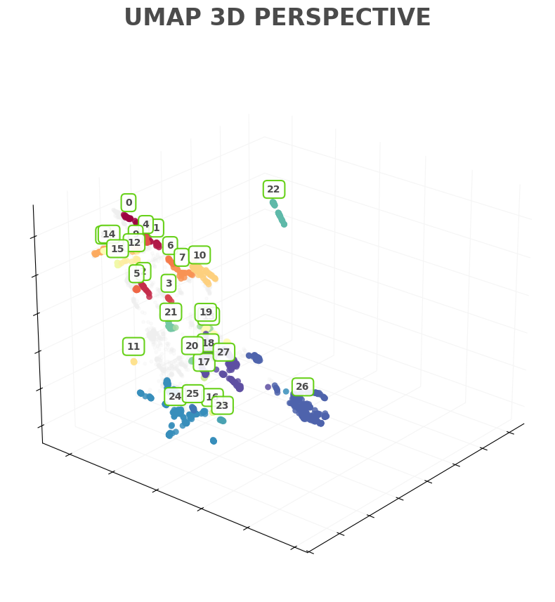

# DuoBuddy: Precision Peer Matching System

### **KU Leuven Datathon 2026 | Team Team**

DuoBuddy is a data-driven peer matching system for language learners. We believe that language learning should not be a solitary journey. By analyzing a user's **"Semantic Capability Fingerprint,"** we identify the most compatible partners for every learner, transforming social interaction into the ultimate engine for persistent learning.

---

## Project Objective

In language learning, **"loneliness"** is a primary driver of attrition. DuoBuddy aims to break these silos. By precisely calculating the "distance" between users based on learning trajectories and knowledge gaps, we enable two core matchmaking modes:

- **The Twins:** Learners with equivalent proficiency levels currently tackling the same grammatical hurdles, ideal for peer discussion and collaborative progress.
- **The Opposites:** Complementary pairing where one's strength is another's weakness (e.g., one masters verb conjugation while the other excels in situational vocabulary), ideal for peer tutoring.

---

## User Segmentation & Proficiency Visualization

The dashboard below visualizes the results of our user clustering engine (HDBSCAN), transforming raw learning data into actionable social cohorts.

To understand the specific linguistic profiles (e.g., which grammar rules or vocabulary sets Lex Cluster 5 or Lex Cluster 12 specializes in), please refer to our detailed mapping file:

👉 [**/data/lexeme_cluster_interpretation.md**](/data/lexeme_cluster_interpretation.md)

---

## Data Synergy & Experimental Scope

This project deeply integrates the two core datasets provided for this competition. **Notably, to ensure the integrity of the model features, the initial phase focuses exclusively on Portuguese (pt) learners. Portuguese data is the only subset consistently and comprehensively represented across both Dataset A and Dataset B, allowing us to build a highly accurate cross-dataset feature matrix.**

### 1. Dataset A (Spaced Repetition Data) — Capturing Memory Dynamics

- **Utility:** Provides the forgetting curves and practice history for individual lexemes.
- **Metrics:** Utilizes `history_seen` and `history_correct` to define a user's "learning stability" over a temporal axis.

### 2. Dataset B (2020 STAPLE Shared Task Data) — Capturing Semantic Breadth

- **Utility:** Enriches lexemes with semantic context and translation diversity.
- **Metrics:** Clusters thousands of lexemes into **81 Semantic Clusters** (e.g., tenses, daily life, syntax), defining the "depth and breadth" of a user's capability fingerprint.

---

## Feature Engineering Dimensions

We extracted four key dimensions to define each user's unique fingerprint, with a focus on mastery and acquisition kinetics:

### 1. Lexeme Mastery

Captures true proficiency by weighting historical correctness against lexeme difficulty.
$$M = \frac{\sum_{i=1}^{n} (Correct_i \times Difficulty_i)}{\sum_{i=1}^{n} Seen_i}$$
_Where $Correct$ is a binary outcome and $Difficulty$ is derived from global lexeme halflife statistics._

### 2. Learning Speed

Measures the velocity of vocabulary acquisition over the active learning period.
$$S = \frac{V_{unique}}{T_{max} - T_{min}}$$
_Where $V_{unique}$ is the total unique lexemes encountered, and $T$ represents the timestamp of activity.\_

| Dimension      | Metric               | Business/Pedagogical Value                                                             |
| :------------- | :------------------- | :------------------------------------------------------------------------------------- |
| **Mastery**    | **Lexeme Mastery**   | Accuracy weighted by lexeme difficulty; represents true proficiency.                   |
| **Exposure**   | **Lexeme Exposure**  | Normalized practice counts; reflects investment in specific domains.                   |
| **Progress**   | **User Level Proxy** | Uses maximum exposure to locate the user on the overall learning path.                 |
| **Efficiency** | **Learning Speed**   | Vocabulary acquisition per unit of time; distinguishes "sprinters" from "marathoners." |

To understand the specific processed file, please refer to our data description file:

👉 [**/data/readme.md**](/data/readme.md)

---

## Clustering & Matchmaking Strategy

To achieve high-precision pairing, we experimented with the following algorithmic paths:

- **K-Means (Baseline):** Establishing fundamental learner segments.
- **HDBSCAN:** Identifying natural "skill pockets" while filtering out outliers or bot-like behavior.
- **Autoencoder Embeddings:** Utilizing neural networks to capture non-linear relationships, compressing 81-dimensional features into a **Latent Space** for deep matching.
- **Distance Metric:** Employs **Cosine Similarity** to measure feature orientation, ensuring users with similar "capability structures" are matched together.

The clustering result base on HDBSCAN as shown in below:

---

## Future Work

Utilizing our **calculated User Fingerprints** and clustering algorithms, we envision the following social features to enhance Duolingo’s "Friend Quest" ecosystem:

1.  **Interactive Matchmaking (Dynamic Testing):**
    After completing daily lessons, users receive a DuoBuddy notification. Upon entering the matching page, the system generates a real-time "Synergy Test" focusing on shared strengths and weaknesses. If the compatibility threshold is met, users can instantly add each other as friends.

2.  **Experience Synergy (Weighted XP Sharing):**
    Moving beyond simple reminders, we propose a weighted XP sharing mechanism. When "Twins" or "Opposites" complete a shared quest, they receive bonus XP based on their fingerprint synergy, incentivizing collaborative effort.

3.  **Collaborative Practice Hub:**
    When one DuoBuddy makes a mistake, the specific problem is added to the Practice Hub of **both** users. This promotes a "learn from each other's failures" environment, doubling the learning efficiency.

4.  **Contextual Peer-to-Peer Chat:**
    Integrated chat functionality allowing buddies to communicate directly after lessons. Users can engage in actual conversation targeting the specific semantic clusters where they both face challenges.

---

## Roadmap

- [x] **Feature Matrix:** Construction of the base feature matrix (Feb 22)
- [x] **Data Fusion:** Integrating Dataset A & B - Focus on 'pt' subset (Feb 23)
- [x] **Autoencoder:** Training and extracting latent feature embeddings (Feb 24)
- [x] **Clustering Experiments:** Evaluating multi-model results for optimal pairing (Feb 25 AM)
- [x] **Final Pitch:** Completing 3D t-SNE visualizations and final presentation (Feb 25 PM)

---

## About Us

This project is a submission for the **KU Leuven Datathon 2026**.

> **"We don't just match users; we match minds."**

---

Explore the experiments: Open files in the `notebooks/` folder.
